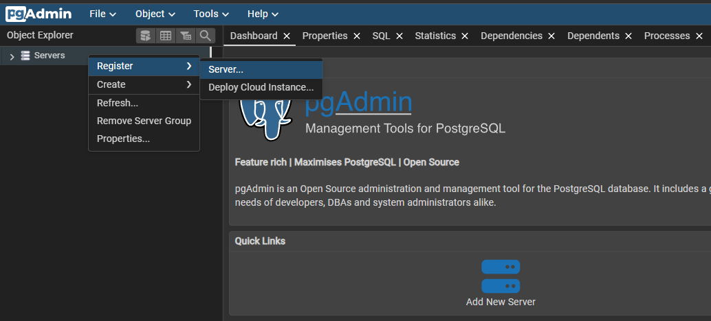
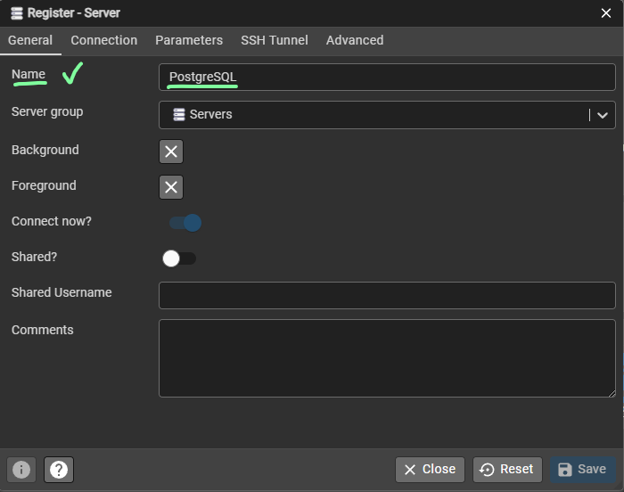
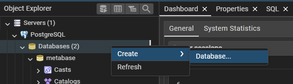
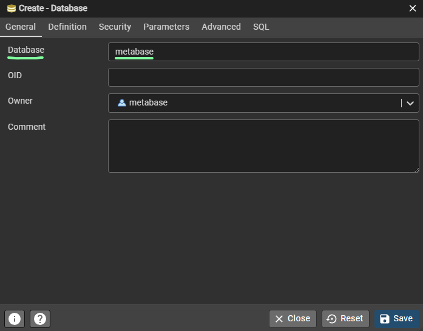
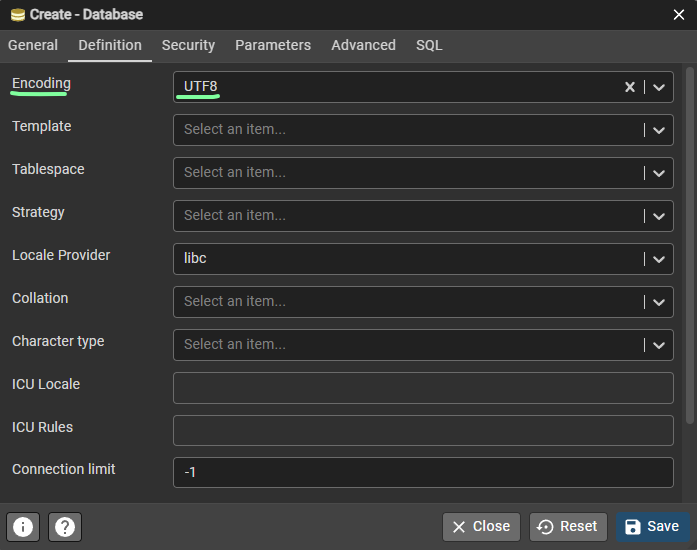

# Introduction

This repository contains the docker compose file and instructions to initialize a postgresql server, pgadmin and metabase images in a local environment for testing.

# Setting up pgAdmin

## Image Pull

The first step to setup postgres in our containers environment is to pull and download the images:

* postgres
* dpage/pgadmin4

We use the following commands:

```bash
docker pull postgres
docker pull dpage/pgadmin4
```

Then we can start our compose file which contain the relevant information and environment variables for initializing the services.

## Containers Compose

We can use the following command if we have just one compose.yaml file:

```bash
docker compose up -d
```

The `-d` flag can be used to run the container in detached mode and is optional.

With multiple compose.yaml files in the same directory the following command should be used:

```bash
docker compose -f compose_postgres.yaml up
```

The `-f` flag is used to specify the location of the compose file that should be used for deployment.

## Ports

When running the compose file we are exposing the following ports in the local network:

* postgres: 5432
* pg-admin: 82

## Connecting pgAdmin to PostgresDB

### Login

Log in with the credentials defined in the compose file:

* user: david.echajaya@hotmail.com
* password: testing

### Register the Server (First time)

Right click on 'Servers' in the object explorer to register a new server.



In the 'General' tab of the register window enter a custom name for the server connection.



In the connection tab we should input the following information:

* **Host name/address:** this should be the name or address of the network in which the database is deployed. In this case is the local network so we should input our Ipv4 direction instead of the localhost (remember that localhost refers to the containers environment in this context)
* **Port:** this is the port we mapped in our compose field.
* **Maintenance database:** is the name of the initial database created automatically for maintenance (Do not interact with this DB)
* **Username:** is the username defined in the compose file in the postgres service
* **Password:** is the password defined in the compose file in the postgres service

The information should be filled as following:


The user and password should be the same as the ones defined in the compose file:

* **Username:** metabase
* **Password:** testing

Finally we click on save.

# Setting Up Postgres

We can create a database from the object explorer as following:



Now in the pop-up we can configure the entire database parameters but for now we will be creating a basic database just for testing. We input the name and the encoding:





Finally click on save.

## Table Schemas Creation

For creating the table schemas we can use the pgAdmin interface or execute a SQL script directly in the database we're using.

The base SQL script format for creating a table is:

```SQL
CREATE TABLE IF NOT EXISTS public.invoices_copy
(
    invoice_id integer NOT NULL,
    sale_id integer,
    created_at date,
    value integer,
    CONSTRAINT invoices_copy_pkey PRIMARY KEY (invoice_id)
)

TABLESPACE pg_default;

ALTER TABLE IF EXISTS public.invoices_copy
    OWNER to metabase;
```
